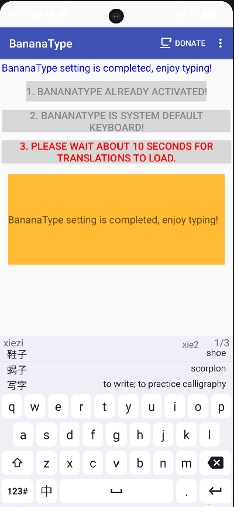

## BananaType

A Chinese Pinyin keyboard (Android IME) with a learn-while-you-type twist:
English glosses from the CC-CEDICT dictionary appear right next to each
Chinese candidate word as you type — e.g. "airplane" next to 飞机.

## Why

Most Pinyin keyboards assume you already know the character you're typing.
BananaType surfaces a plain-English gloss for every candidate in real time,
so the keyboard doubles as a lightweight vocabulary aid for learners.

## How it works

- A custom keyboard layout with Pinyin input on the main QWERTY page and a
  symbols page, styled with a Gboard-inspired light theme (white keys,
  lavender background, custom icons).
- A candidate bar sits directly above the keyboard, showing ranked Pinyin
  matches as you type; swipe left/right on the bar to page through more
  candidates.
- A modified version of CC-CEDICT is bundled as a plain-text asset and loaded
  into an in-memory dictionary at startup. Each candidate word is looked up
  against it, and its English gloss is shown right next to the Chinese candidate.
- A toggle key switches between Chinese and English input modes, hiding the
  candidate bar in English mode.
- Built on a modernized fork of the decade-old
  [OpenHeInput-Android](https://github.com/HeChinese/OpenHeInput-Android)
  project, updated to current Gradle/AGP and Android API levels.

## Tech stack

Java, Android SDK, XML (layouts/resources), Gradle

## License

This project is proprietary (see [LICENSE](LICENSE)). It bundles CC-CEDICT
(CC BY-SA 4.0) and jieba word-frequency data (MIT) — see
[NOTICE.md](NOTICE.md) and [licenses/](licenses/) for full attribution.
